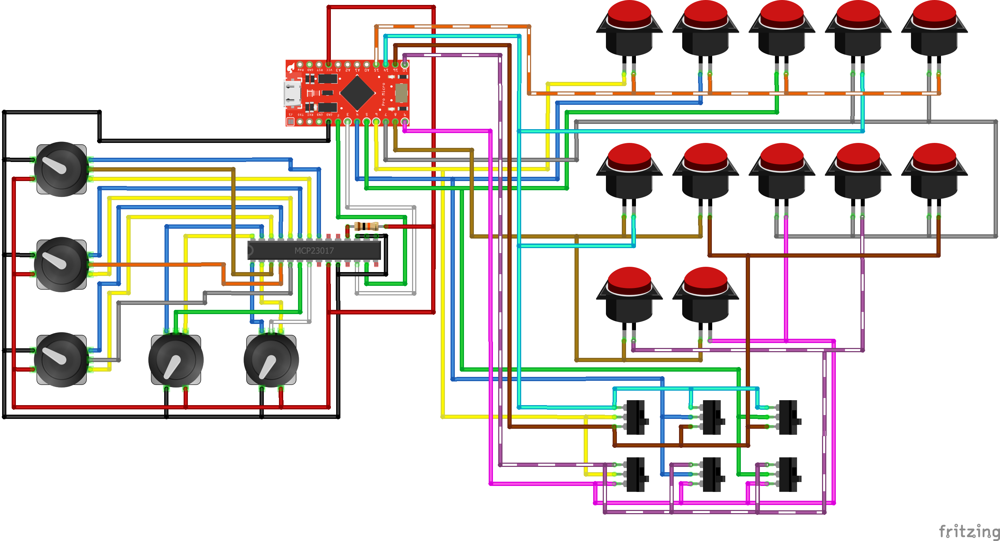

# Arduino Pro Micro based Button Box expanded with MCP23017 over I2C.
I participate in sim-racing in my spare time. As part of my sim rig, I have a Logitech G29 racing wheel with a few buttons. Some of those buttons are currently covered by the OMP-style wheel I have attached to replace the reasonably small stock wheel.
Even as stock, the G29 doesn't have a wide plethora of buttons -- so I wanted to add some to the sim rig.

Enter: Arduino Pro Micro, with the Joystick library which allows it to emulate as a joystick to Windows, and an MCP23017 to provide me with:
- 12 momentary push-buttons, 
- 6 momentary two-way switches, and 
- 5 rotary encoders with buttons.

This just gives me all the buttons options I need.

The Arduino Pro Micro comes with 18 available pins with which to construct the necessary keypad matrix:

The starting point on a Pro Micro is therefore that it is possible to construct a button box with 81 buttons!
*However!*
I really wanted to have rotary encoders on my button box, for no particular reason. I also have no particular reason for wanting five of them -- other than there were five in the box!
Each rotary encoder requires two pins to the `CLK` and `DT` connections on the encoder. This means that my initial 18 pins on the Pro Micro dropped down to 8, and a maximum keypad matrix of 4x4 on which to fit a total of 29 buttons. It should be pretty clear that this is a problem.

This is where the MCP23017 comes in. 
(For a great article on MCP23017, see this  [this one](https://www.best-microcontroller-projects.com/mcp23017.html) by John Main on his website. Really informative! The pinout schematic is incredibly useful too.)

By connecting the MCP23017 to the `SDA` and `SCL` pins (sacrificing 2 on the Pro Micro), you gain an additional 16! Additionally, it is possible to daisy-chain an additional 7 expanders, giving you up to 128 addressable pins over I2C!
Within this project, I merely use *one* MCP23017, as I didn't need more pins.

The way I approached this project was to construct two separate parts to the button box: a 5x5 keypad matrix connected to ten pins directly on the Pro Micro, and the rotary encoders and buttons connected through the MCP23017.
The momentary switches on the rotary encoders is the least efficient part of this project, as I use five direct pins. Had I constructed a 2x3 keypad matrix, I could expand to add a sixth switch later - but I don't foresee any changes to the button layout any time soon!

The libraries I used were
1. [Keypad.h](https://github.com/Chris--A/Keypad)
2. [Joystick.h (ArduinoJoystickLibrary)](https://github.com/MHeironimus/ArduinoJoystickLibrary)
3. [Wire.h (for I2C)](https://www.arduino.cc/en/Reference/Wire)
4. [Adafruit_MCP23017.h](https://github.com/adafruit/Adafruit-MCP23017-Arduino-Library)

The sketch starting point was something I'd seen online. I saw Ben Buxton's [Rotary library](https://github.com/buxtronix/arduino/tree/master/libraries/Rotary), and how it had been used in [AmStudio's Button Box](https://github.com/AM-STUDIO/32-FUNCTION-BUTTON-BOX) for example. I knew I needed to figure out what things were combined, how they worked and how to make it work for me.

Have a look at the sketch and get in touch if you have feedback or thoughts!

This is what the wiring looked like for me, doing it with the MCP23017, encoders and all.
The MCP23017 requires a 10k resistor on the reset pin to VCC, and I've used 0x0 as the address for the MCP since I'm only using one.
